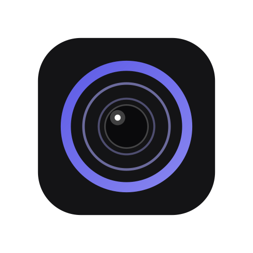

> [!NOTE]
> This repository is an independent fork of [OpenScreen](https://github.com/EtienneLescot/openscreen).
>
> OpenScreen was originally created by [Siddharth Vaddem](https://github.com/siddharthvaddem); that repository was archived after v1.5.0 and remains available here: [siddharthvaddem/openscreen](https://github.com/siddharthvaddem/openscreen). It was continued as a community project by [Etienne Lescot](https://github.com/EtienneLescot) at [EtienneLescot/openscreen](https://github.com/EtienneLescot/openscreen), which this fork builds on.
>
> Íris keeps the same MIT-licensed, fully open-source core, focused on a lighter, more stable, and more polished experience.

> [!WARNING]
> Íris is early-stage software. You should expect bugs, rough edges, and occasional breaking changes.

<p align="center">
  
</p>

# <p align="center">Íris</p>
<p align="center"><strong>Íris is a free, open-source screen recorder for creating polished screen recordings, product demos, and walkthroughs — a leaner, faster, more refined fork of OpenScreen.</strong></p>

<p align="center">
  <a href="./LICENSE"></a>
  <a href="https://github.com/eduardoaugustolb/iris/releases/latest"></a>
  <a href="https://github.com/eduardoaugustolb/iris/actions/workflows/ci.yml"></a>
  
</p>

Íris takes everything OpenScreen already did well — recording, zooms, cursor effects, webcam overlay, captions, editing, annotations, and export — and rebuilds the experience around three goals: **lighter** (lower resource usage, faster startup), **more stable** (fewer crashes, more predictable recording pipeline), and **more refined** (a native, premium interface with real attention to detail, documented in [`DESIGN.md`](./DESIGN.md)).

It is not a rewrite from scratch and not a divergent product — it's the same open-source workflow, tuned and polished. The goal is to keep everything that made OpenScreen good, while removing friction and rough edges.

**100% free** for both **personal** and **commercial** use. Use it, modify it, distribute it. Please respect the license.

> [!NOTE]
> Software should be accessible. Íris has no paid tiers, premium features, upsells, or functionality locked behind a paywall.

<p align="center">
	
  
</p>

## Core Features

- Record a specific window, or your whole screen.
- Record microphone and system audio.
- Webcam overlay with picture-in-picture, drag-to-position, mirroring, and shape options.
- Auto or manual zooms with adjustable depth, duration, easing, and pixel-precise position; auto-zoom follows your cursor as you work.
- Custom cursor size, smoothing, and click effects, with cursor themes and post-recording path smoothing.
- Automatic captions for voiceovers, generated on-device with no upload (works offline).
- Wallpapers, solid colors, gradients, or your own background image.
- Motion blur.
- Crop, trim, and per-segment speed control on the timeline.
- Text, arrow, and image annotations, with text animation presets.
- Timeline snapping guides and an audio waveform to make trimming easier.
- Customizable keyboard shortcuts.
- Export to MP4 or GIF in multiple aspect ratios and resolutions.
- Languages supported: Arabic, English, Spanish, French, Italian, Japanese, Korean, Portuguese (Brazil), Russian, Turkish, Vietnamese, Simplified Chinese, and Traditional Chinese.

## Why this fork exists

OpenScreen's core workflow is solid, but this fork exists to push three things further than the upstream roadmap prioritizes:

- **Performance** — lower idle and recording-time resource usage, faster app launch, smaller install size.
- **Stability** — hardening the capture and export pipeline so recordings don't fail silently or corrupt on edge cases.
- **Interface polish** — a redesigned, native-feeling UI built around a documented design system (see [`DESIGN.md`](./DESIGN.md)), instead of incremental UI tweaks on top of the original.

## Installation

Download the latest installer from the [GitHub Releases](https://github.com/eduardoaugustolb/iris/releases) page.

### macOS

Download the `.dmg` installer directly from the [Releases page](https://github.com/eduardoaugustolb/iris/releases). If Gatekeeper blocks the app, bypass it by running the following command in your terminal after installation:

```bash
xattr -rd com.apple.quarantine /Applications/Iris.app
```

Note: Give your terminal Full Disk Access in **System Settings > Privacy & Security** to grant you access, then run the command above.

After running this command, go to **System Settings > Privacy & Security** to grant the necessary permissions for "Screen Recording" and "Accessibility." Once permissions are granted, launch the app.

> [!NOTE]
> **Upgrading and hitting permission issues?** If you already had Íris installed and the new version won't record (Screen Recording or Accessibility keep failing even after you grant them), uninstall the old version, remove Íris's existing entries under **System Settings > Privacy & Security** (both Screen Recording and Accessibility), then do a fresh install and grant the permissions again when prompted.

> [!NOTE]
> Íris targets **macOS, Windows, and Linux** — see [Platform scope](#platform-scope) below.

## Platform scope

Everything in the editor and export — zooms, backgrounds, motion blur, crop/trim/speed, blur regions, annotations, auto-captions, projects, export, and all languages — works identically across platforms. Capture uses the native pipeline of each OS: **ScreenCaptureKit** on macOS (clean window-level recording, real cursor capture powering cursor themes and click effects, native webcam capture) and **WGC** (Windows Graphics Capture) on Windows; Linux ships with native packaging (Nix/flake).

**System audio**: requires macOS 13+. On macOS 14.2+ you'll be prompted to grant audio capture permission. macOS 12 and below can't capture system audio (microphone still works).

## Design

Íris follows a documented visual identity — color tokens, typography scale, glass material specification, motion curves, and component states are all defined in [`DESIGN.md`](./DESIGN.md). Any UI contribution should be built against that spec rather than ad hoc styling.

## Official links

This repository is an independent continuation of OpenScreen, maintained separately from both the original project and the EtienneLescot fork.

Related projects:
* Original archived repository: https://github.com/siddharthvaddem/openscreen
* Upstream continuation (OpenScreen): https://github.com/EtienneLescot/openscreen
* Íris: https://github.com/eduardoaugustolb/iris

For safety, download Íris only from the official GitHub Releases linked from this repository. Third-party websites using the Íris name are not affiliated with this project unless explicitly listed here.

## Community

- 🐞 **[GitHub Issues](https://github.com/eduardoaugustolb/iris/issues)** — bug reports and feature requests
- 🗺️ **[Roadmap](./ROADMAP.md)** — see what's being built next

---

## License

This project is licensed under the [MIT License](./LICENSE). By using this software, you agree that the authors are not liable for any issues, damages, or claims arising from its use.
